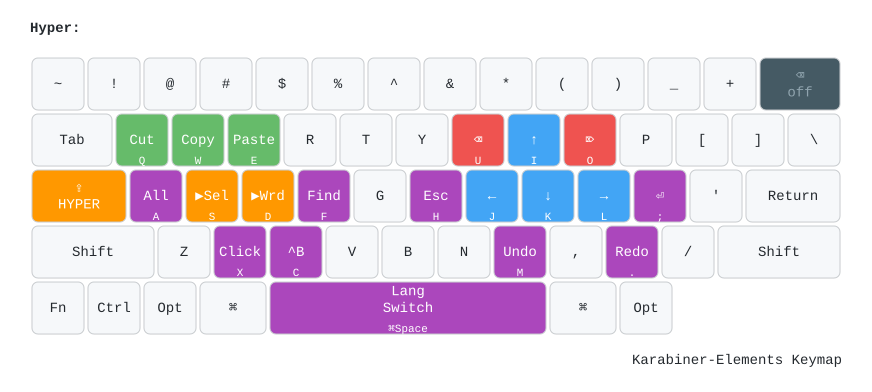
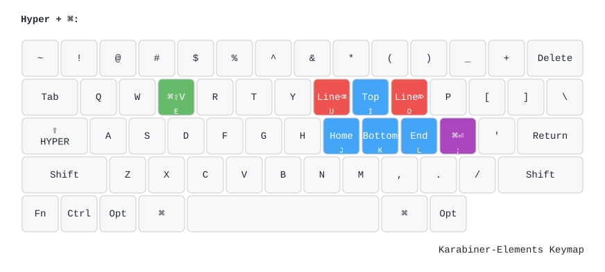
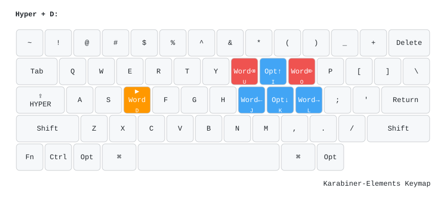
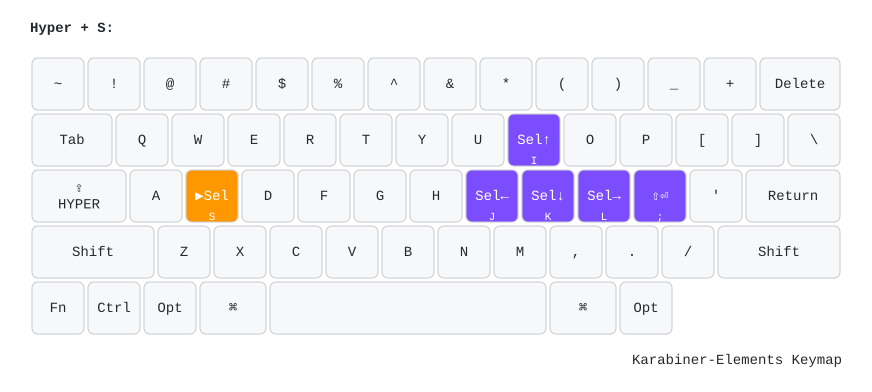
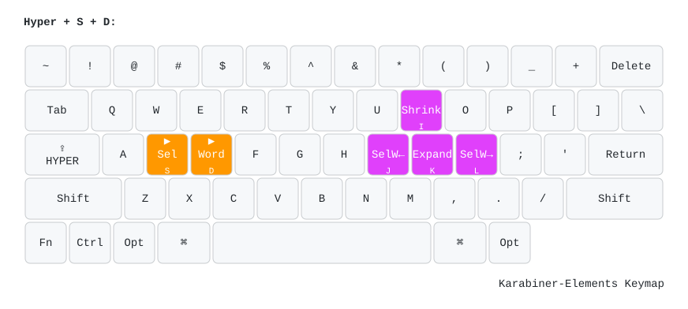
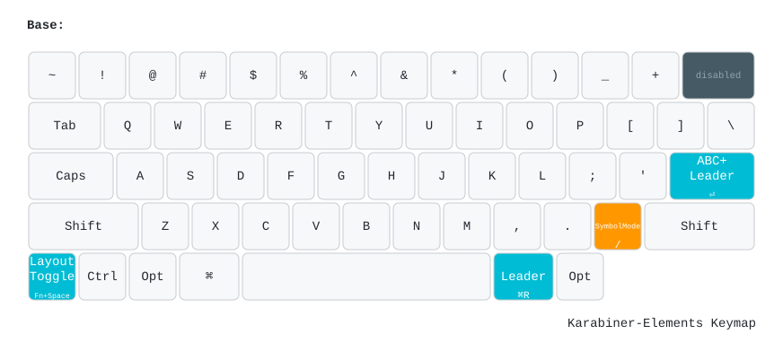

# Karabiner-Elements Keymap

Custom keyboard layout built with Karabiner-Elements. CapsLock is remapped to a **Hyper key** that activates vim-style navigation, deletion, clipboard, and selection layers.

## Color Legend

| Color | Category |
|-------|----------|
| Blue `#42a5f5` | Navigation |
| Red `#ef5350` | Deletion |
| Green `#66bb6a` | Clipboard |
| Purple `#ab47bc` | System |
| Orange `#ff9800` | Layer Activator |
| Dark `#455a64` | Disabled |
| Deep Purple `#7c4dff` | Selection |
| Pink `#e040fb` | Word Selection |
| Cyan `#00bcd4` | Remap |

---

## Layers

### 1. Hyper Layer (`⇪` CapsLock held)

Main layer. Vim-style navigation (IJKL), deletion (UO), clipboard (QWE), and system shortcuts.



| Key | Action | Category |
|-----|--------|----------|
| `⇪+I/J/K/L` | ↑/←/↓/→ | Navigation |
| `⇪+U` | Backspace | Deletion |
| `⇪+O` | Forward Delete | Deletion |
| `⇪+Q` | Cut | Clipboard |
| `⇪+W` | Copy | Clipboard |
| `⇪+E` | Paste | Clipboard |
| `⇪+A` | Select All | System |
| `⇪+F` | Find | System |
| `⇪+H` | Escape | System |
| `⇪+;` | Enter | System |
| `⇪+M` | Undo | System |
| `⇪+.` | Redo | System |
| `⇪+X` | Mouse Click | System |
| `⇪+C` | Ctrl+B | System |
| `⇪+Space` | Language Switch (⌘Space) | System |
| `⇪+S` | Activate Selection Layer | Layer |
| `⇪+D` | Activate Word Layer | Layer |

---

### 2. Hyper + ⌘ Layer (`⇪` + `⌘` held)

Line/page-level navigation, line deletion, clipboard manager, and ⌘+Enter.



| Key | Action | Category |
|-----|--------|----------|
| `⇪+⌘+I` | Top of document | Navigation |
| `⇪+⌘+K` | Bottom of document | Navigation |
| `⇪+⌘+J` | Home (line start) | Navigation |
| `⇪+⌘+L` | End (line end) | Navigation |
| `⇪+⌘+U` | Delete line backward | Deletion |
| `⇪+⌘+O` | Delete line forward | Deletion |
| `⇪+⌘+E` | Clipboard manager (⌘⇧V) | Clipboard |
| `⇪+⌘+;` | ⌘+Enter | System |

---

### 3. Hyper + D Layer (`⇪` + `D` held — Word Level)

Word-level navigation and deletion. Hold CapsLock + D, then use IJKL/UO.



| Key | Action | Category |
|-----|--------|----------|
| `⇪+D+J` | Word left (⌥←) | Navigation |
| `⇪+D+L` | Word right (⌥→) | Navigation |
| `⇪+D+I` | Option+Up | Navigation |
| `⇪+D+K` | Option+Down | Navigation |
| `⇪+D+U` | Delete word backward (⌥⌫) | Deletion |
| `⇪+D+O` | Delete word forward (⌥⌦) | Deletion |

---

### 4. Hyper + S Layer (`⇪` + `S` held — Selection)

Character-level selection with IJKL.



| Key | Action | Category |
|-----|--------|----------|
| `⇪+S+J` | Select left (⇧←) | Selection |
| `⇪+S+L` | Select right (⇧→) | Selection |
| `⇪+S+I` | Select up (⇧↑) | Selection |
| `⇪+S+K` | Select down (⇧↓) | Selection |
| `⇪+S+;` | Shift+Enter | Selection |

---

### 5. Hyper + S + D Layer (`⇪` + `S` + `D` held — Word Selection)

Word-level selection. I/K control VS Code selection expand/shrink.



| Key | Action | Category |
|-----|--------|----------|
| `⇪+S+D+J` | Select word left (⌥⇧←) | Word Selection |
| `⇪+S+D+L` | Select word right (⌥⇧→) | Word Selection |
| `⇪+S+D+I` | Shrink selection | Word Selection |
| `⇪+S+D+K` | Expand selection | Word Selection |

---

### 6. Base Modifications (Non-Hyper Remaps)

Standalone key remaps and disabled keys, active without holding CapsLock.



| Key | Action | Category |
|-----|--------|----------|
| `⏎` (Return) | Switch to ABC + Leader key | Remap |
| `⌘R` | Leader key | Remap |
| `Fn+Space` | Toggle QWERTY/Colemak layout | Remap |
| Hold `/` | Activate Symbol Mode | Layer |
| `⌫` (Backspace) | Disabled | Disabled |

---

## Additional Features

### Disabled Standard Shortcuts

These common shortcuts are disabled to enforce Hyper layer usage:

| Shortcut | Replaced by |
|----------|-------------|
| `⌘A` (Select All) | `⇪+A` |
| `⌘C` (Copy) | `⇪+W` |
| `⌘V` (Paste) | `⇪+E` |
| `⌘X` (Cut) | `⇪+Q` |
| `⌘Z` (Undo) | `⇪+M` |

### Colemak Layout (`Fn+Space` toggle)

When Colemak mode is active, alpha keys remap:

```
QWERTY:  Q  W  E  R  T  Y  U  I  O  P
Colemak: Q  W  F  P  B  J  L  U  Y  ;

QWERTY:  A  S  D  F  G  H  J  K  L  ;
Colemak: A  R  S  T  G  M  N  E  I  O

QWERTY:  Z  X  C  V  B  N  M
Colemak: X  C  D  V  Z  K  H
```

### Symbol Mode (hold `/`)

While holding `/`, number keys paste modifier symbols:

| Key | Symbol |
|-----|--------|
| `1` | ⌘ |
| `2` | ⌥ |
| `3` | ⌃ |
| `4` | ⇧ |
| `5` | ⇪ |
